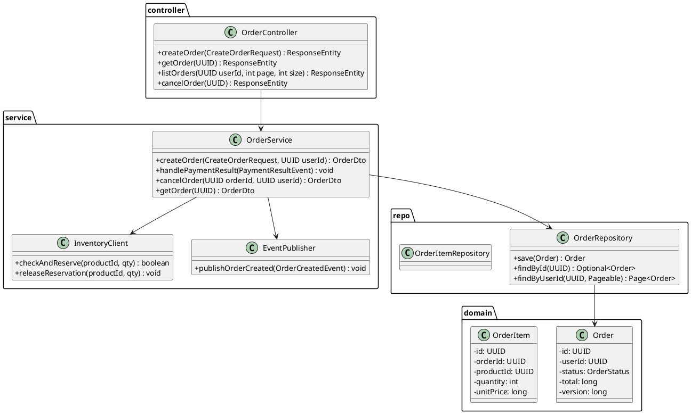
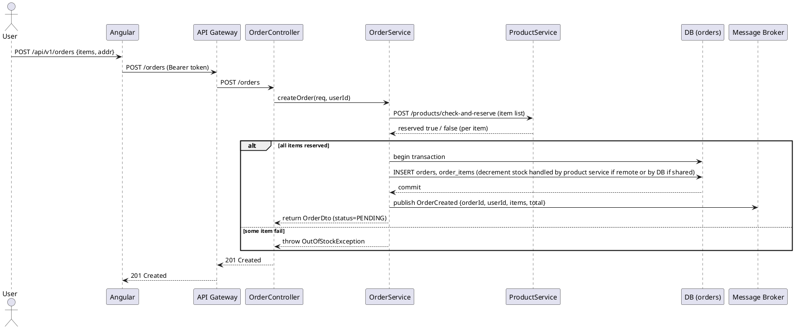
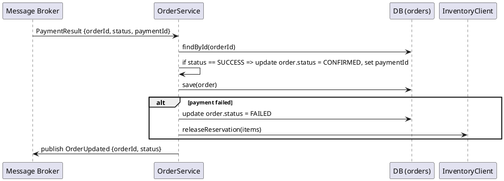
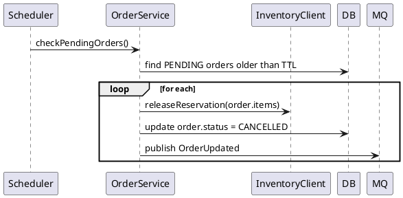

# Order Service — Low‑Level Design (LLD)

> Purpose: Detailed low‑level design for the **Order Service** in the Microservices Mini‑Ecommerce project. This document contains class diagrams (PlantUML), sequence diagrams, DTOs, API contracts (OpenAPI style), persistence schema, transaction & concurrency strategy, event contracts, error handling, testing, logging, and sample code snippets.

---

## 1 — Goals & Responsibilities

Order Service is responsible for:

* Accepting order creation requests (checkout)
* Validating cart and user authorization
* Reserving/decrementing product stock atomically
* Creating order and order items with correct status lifecycle
* Publishing `OrderCreated` events for downstream consumers (Payment Service, Notifications)
* Consuming `PaymentResult` (or payment webhook events) to move orders to `CONFIRMED`/`FAILED`
* Handling cancellations, timeouts, and compensating actions (restore stock)
* Providing order query endpoints (by id, by user)
* Ensuring idempotency and resilience in distributed environment

Non‑functional:

* Strong consistency for stock decrement and order creation (use DB transaction)
* Eventual consistency across microservices via message broker
* Idempotent event handlers and API endpoints

---

## 2 — Tech Stack & Key Libraries

* Java 17, Spring Boot 3.x
* Spring Web, Spring Data JPA
* MySQL / Postgres (ACID) for orders and inventory manipulation
* Redis for distributed locks / idempotency store (optional) and dedup
* RabbitMQ or Kafka for message bus
* Resilience4j (retries, circuit breaker)
* Testcontainers for integration tests
* Micrometer + Prometheus, OpenTelemetry/Jaeger for tracing

---

## 3 — Data Model (ERD)

Core tables (relational):

**orders**

* id: UUID (PK)
* user_id: UUID (FK to users service or just user id)
* total_cents: bigint
* currency: varchar(3)
* status: varchar(20) (PENDING, CONFIRMED, FAILED, CANCELLED)
* created_at: timestamp
* updated_at: timestamp
* payment_id: UUID (nullable)
* version: bigint (optimistic lock)

**order_items**

* id: UUID (PK)
* order_id: UUID (FK)
* product_id: UUID
* sku: varchar
* unit_price_cents: bigint
* quantity: int

**inventory_reservations** (optional, for advanced reservation pattern)

* id: UUID
* product_id: UUID
* order_id: UUID
* quantity: int
* reserved_at: timestamp
* expires_at: timestamp
* released: boolean

Indexes:

* idx_orders_user (user_id)
* idx_order_status (status)
* fk indexes on order_items.order_id

---

## 4 — Class Diagram (PlantUML)



---

## 5 — Sequence Diagrams (PlantUML)

### 5.1 Create Order (Checkout)



Notes: ProductService check-and-reserve may be a sync call to product-service API that itself performs stock decrement in the product DB or creates a reservation. If product inventory is owned by Product Service, prefer having Product Service manage inventory and perform reservation via a transactional endpoint.

### 5.2 Payment Result Handling



### 5.3 Timeout & Compensating Release

If payment not received in X minutes, a scheduler or delayed message releases reservation:



---

## 6 — DTOs & Event Schemas

### CreateOrderRequest

```json
{
  "items": [
    {"productId":"uuid","quantity":2}
  ],
  "shippingAddress": {
    "line1":"...",
    "city":"...",
    "pincode":"..."
  },
  "currency":"INR"
}
```

### OrderDto (response)

```json
{
  "id":"uuid",
  "userId":"uuid",
  "status":"PENDING",
  "totalCents": 12345,
  "items":[{"productId":"uuid","quantity":2,"unitPriceCents":5999}]
}
```

### OrderCreated Event (published)

```json
{
  "eventId":"uuid",
  "occurredAt":"ISO8601",
  "orderId":"uuid",
  "userId":"uuid",
  "items":[{"productId":"uuid","quantity":2,"unitPriceCents":5999}],
  "totalCents":12345,
  "currency":"INR"
}
```

### PaymentResult Event (consumed)

```json
{
  "eventId":"uuid",
  "orderId":"uuid",
  "paymentId":"uuid",
  "status":"SUCCESS|FAILED",
  "amountCents":12345,
  "providerResponse":"optional string"
}
```

All events should include an `eventId` for dedup and tracing (traceId/spanId). Use JSON schema or avro (Kafka) for strict typing in production.

---

## 7 — API Contracts (OpenAPI style)

Base path: `/api/v1/orders`

### POST /

* **Auth**: Bearer token (JWT)
* **Request**: `CreateOrderRequest`
* **Responses**:

  * `201 Created` — body: `OrderDto`
  * `400 Bad Request` — validation failures
  * `401 Unauthorized` — missing/invalid token
  * `409 Conflict` — idempotency key duplicate or out-of-stock

### GET /{id}

* **Auth**: Bearer token
* **Responses**:

  * `200 OK` — `OrderDto`
  * `404 Not Found`
  * `403 Forbidden` — if user not owner and not admin

### GET /?userId={userId}

* **Auth**: Bearer token (users can request their own orders)
* **Responses**:

  * `200 OK` — List of `OrderDto`

### POST /{id}/cancel

* **Auth**: Bearer token
* **Responses**:

  * `200 OK` — updated `OrderDto`
  * `400/409` — cannot cancel confirmed order

Idempotency: Clients should send `Idempotency-Key` header for `POST /` to avoid duplicate order creation on retries.

---

## 8 — Transaction & Concurrency Strategy

### Atomicity between stock decrement and order creation

Options:

1. **Single DB owner (product and order share DB)**: use DB transaction (`SELECT FOR UPDATE` on products) to decrement stock then create order in same transaction. Guarantees no oversell.
2. **Separate services owning their own DBs (product-service owns inventory)**: implement reservation API on Product Service (e.g., `POST /products/reserve`) that performs DB transaction inside Product Service. Order Service calls this API before creating order. If banked on network, use two-phase commit-esque pattern or saga.

Recommended for microservices: **Saga pattern (or reservation + confirm)**

* Step 1: Order Service requests Product Service to reserve stock (sync). Product Service reduces available stock and creates reservation record.
* Step 2: Order Service creates order record (STATUS=PENDING).
* Step 3: On payment success, publish `OrderConfirmed` → Product Service marks reservation confirmed (persisted). On payment failure/timeout, send `ReservationRelease` → Product Service restores stock.

### Idempotency

* `POST /orders` must be idempotent by `Idempotency-Key` header. Store mapping `idempotencyKey -> orderId` in Redis with TTL. If duplicate request with same key, return the same order response rather than creating a new one.
* Event handlers must use `eventId` dedup store (Redis) to ignore duplicate events.

### Optimistic locking

* Add `version` column to orders for optimistic locking (`@Version` in JPA) to prevent concurrent updates overwriting each other.

---

## 9 — Error Handling Strategy

Consistent error response model: `{code, message, details(optional)}`.

Common error scenarios & mapping:

* `OutOfStockException` → `409 Conflict` (ORDER_OUT_OF_STOCK)
* `InvalidRequestException` → `400 Bad Request` (ORDER_INVALID_REQUEST)
* `UnauthorizedException` → `401 Unauthorized`
* `ForbiddenException` → `403 Forbidden`
* `OrderNotFoundException` → `404 Not Found`
* `OrderAlreadyFinalizedException` (cannot cancel) → `409 Conflict`
* `PaymentTimeoutException` → mark order `FAILED` and `409` on manual cancellation attempts
* Internal database errors → `500 Internal Server Error` (ORDER_INTERNAL_ERROR)

Log full stack traces server‑side with traceId. Return user‑friendly messages client‑side.

---

## 10 — Reliability, Retries & Compensation

* Use resilient consumers for `PaymentResult` with retries and dead-letter queue for poison messages.
* For synchronous calls to Product Service for reservation, use retries with exponential backoff and circuit breaker. If reservation fails after retries, return `409` to client.
* On partial failures during order creation, run compensating actions: if order insert fails after reservation, call product-service to release reservations.
* Scheduler (cron) or delayed messages to detect `PENDING` orders older than TTL and cancel them (release reservations).

---

## 11 — Observability & Metrics

Metrics to expose (Micrometer):

* `orders.created.count`
* `orders.created.failed`
* `orders.confirmed.count`
* `orders.cancelled.count`
* `orders.latency.create` (timer)
* `orders.payment.processing.time`

Logs: structured JSON including `traceId`, `requestId`, `userId`, `orderId`, `eventId`.

Tracing: propagate trace context in events and HTTP calls.

---

## 12 — Testing Strategy

Unit tests

* OrderService: success creation, out of stock scenario, DB failure compensations.
* Idempotency logic.

Integration tests

* Using Testcontainers for DB, RabbitMQ, Redis (for idempotency keys)
* Full create-order -> payment-result -> order-confirmed flow

Contract tests

* Consumer-driven contract tests between OrderService and ProductService reservation API

E2E tests

* Using Postman / Playwright to test frontend + API flows in staging.

---

## 13 — Folder Structure

```
order-service/
  src/main/java/com/microecom/order
    controller/
      OrderController.java
    service/
      OrderService.java
      PaymentResultListener.java
      SchedulerService.java
    client/
      ProductClient.java
      EventPublisher.java
    repository/
      OrderRepository.java
      OrderItemRepository.java
    model/
      Order.java
      OrderItem.java
      enums/OrderStatus.java
    dto/
      CreateOrderRequest.java
      OrderDto.java
    exception/
      OrderExceptions.java
    config/
      MessagingConfig.java
      SecurityConfig.java
  src/test/java/...
  Dockerfile
  application.yml
  k8s/ (deployment manifests)
```

---

## 14 — Sample Code Snippets

### 14.1 Idempotency check (pseudo)

```java
public OrderDto createOrder(CreateOrderRequest req, UUID userId, String idempotencyKey) {
  if (idempotencyKey != null) {
    String existing = redis.get("idem:"+idempotencyKey);
    if (existing != null) return orderRepository.findById(UUID.fromString(existing)).toDto();
  }

  // Reserve stock via product client
  boolean reserved = productClient.reserve(req.getItems(), requestId);
  if (!reserved) throw new OutOfStockException();

  // create order in transaction
  Order order = saveOrder(req, userId);

  // persist idempotency mapping
  if (idempotencyKey != null) redis.set("idem:"+idempotencyKey, order.getId().toString(), TTL);

  publishOrderCreated(order);
  return order.toDto();
}
```

### 14.2 Handle PaymentResult (pseudo)

```java
@RabbitListener(queues = "payment.results")
public void onPaymentResult(PaymentResultEvent event) {
  if (!tryMarkProcessed(event.getEventId())) return; // dedup
  Order order = orderRepository.findById(event.getOrderId()).orElseThrow();
  if (event.isSuccess()) {
    order.setStatus(OrderStatus.CONFIRMED);
    order.setPaymentId(event.getPaymentId());
    orderRepository.save(order);
  } else {
    order.setStatus(OrderStatus.FAILED);
    orderRepository.save(order);
    productClient.releaseReservation(order.getItems());
  }
  publishOrderUpdated(order);
}
```

---

## 15 — Security Considerations

* Validate JWT and userId matches request owner for `GET`/`CANCEL` operations.
* Sanitize inputs for productId and quantity.
* Rate limit `POST /orders` to mitigate spam.
* Do not log PII or payment details.

---

## 16 — Next Steps (I can produce)

* PlantUML diagram PNG exports for the included diagrams
* OpenAPI YAML for Order Service endpoints
* Starter Spring Boot project scaffold (controllers, services, repositories, Dockerfile, tests)
* Sample integration test using Testcontainers

Tell me which artifact you want next and I’ll generate it immediately.
