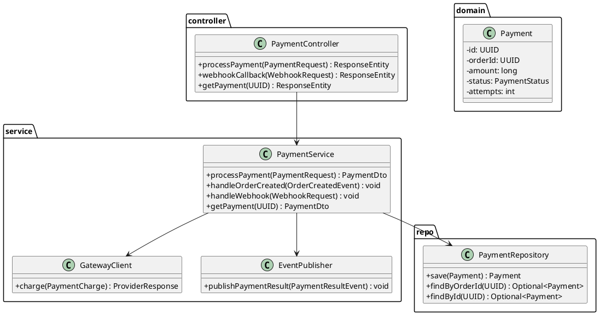
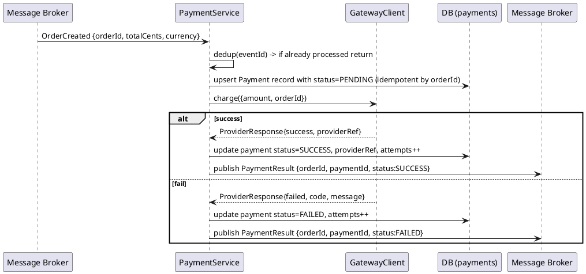
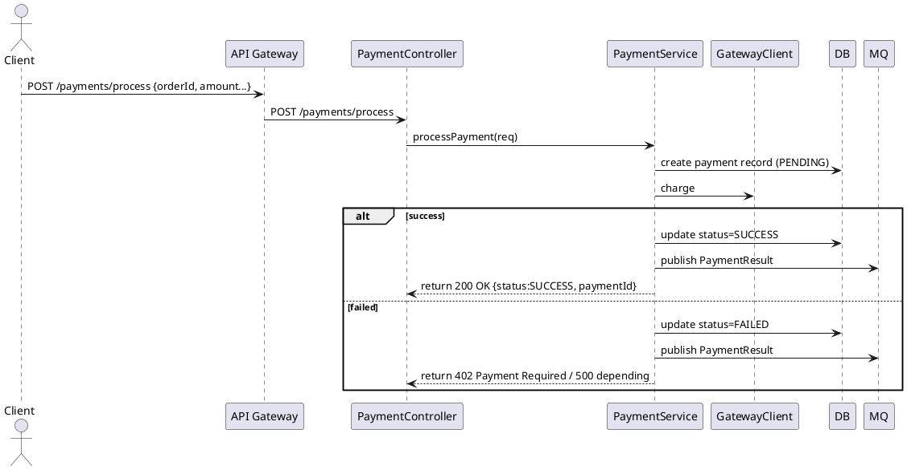
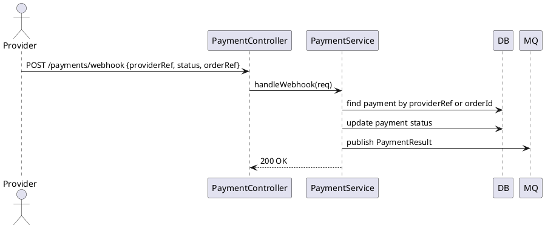

# Payment Service — Low‑Level Design (LLD)

> Purpose: Provide a detailed low‑level design for the **Payment Service** in the Microservices Mini‑Ecommerce system. Contains class diagrams (PlantUML), sequence diagrams, DTOs, API contracts (OpenAPI style), persistence, idempotency & retry strategies, error handling, security, metrics, testing plan, folder structure and code snippets.

---

## 1 — Goals & Responsibilities

Payment Service responsibilities:

* Consume `OrderCreated` events and/or provide `POST /payments/process` for synchronous invocation
* Simulate payment processing (card/wallet) and integrate with external payment gateway abstraction (pluggable)
* Publish `PaymentResult` events (SUCCESS / FAILED)
* Persist payment records and audit trail
* Expose webhook endpoint for third‑party provider callbacks (simulated)
* Provide status endpoint `GET /payments/{id}`
* Ensure idempotent processing and safe retries

Non‑functional:

* Idempotency for events and HTTP POSTs
* Resilient to transient failures (retries, DLQ)
* Secure storage of payment-related secrets (API keys) and no sensitive logging
* Observability: metrics, tracing, structured logs

---

## 2 — Tech Stack & Key Libraries

* Java 17, Spring Boot 3.x
* Spring Web, Spring Data JPA
* RabbitMQ / Kafka client for messaging
* MySQL/Postgres for payments table (auditability)
* Redis for idempotency/event dedup store (optional)
* Resilience4j for retry/circuit breaker
* Jackson for JSON
* Testcontainers, JUnit5, Mockito
* Micrometer, OpenTelemetry/Jaeger

---

## 3 — Data Model

**payments** table

* id: UUID (PK)
* order_id: UUID (unique index)
* amount_cents: bigint
* currency: varchar(3)
* status: varchar(20) (PENDING, SUCCESS, FAILED, RETRYING)
* provider: varchar(50) (SIMULATED or REAL)
* provider_reference: varchar(255) (nullable)
* provider_response: text (nullable)
* attempts: int (retry count)
* created_at: timestamp
* updated_at: timestamp
* metadata: json (optional, for card masked info, gateway code)

**processed_events** (Redis or DB) — dedup store

* event_id -> processed_at

Important: do NOT store card PAN or CVV in DB/logs. If simulating card, store masked PAN (last 4 digits) only.

---

## 4 — Class Diagram (PlantUML)



---

## 5 — Sequence Diagrams (PlantUML)

### 5.1 Event-driven flow: OrderCreated → PaymentResult



### 5.2 Synchronous HTTP: Client calls /payments/process



### 5.3 Webhook callback from provider



---

## 6 — DTOs & Event Schemas

### PaymentRequest (HTTP)

```json
{
  "orderId":"uuid",
  "amountCents":12345,
  "currency":"INR",
  "method":{ "type":"CARD", "card": {"maskedPan":"xxxx-xxxx-xxxx-1234", "scheme":"VISA" } },
  "idempotencyKey":"optional-string"
}
```

### PaymentDto (response)

```json
{
  "paymentId":"uuid",
  "orderId":"uuid",
  "status":"PENDING|SUCCESS|FAILED",
  "attempts":0,
  "createdAt":"ISO8601"
}
```

### ProviderResponse (internal)

```json
{
  "success": true,
  "providerReference": "provider-id-123",
  "code": null,
  "message": null
}
```

### PaymentResult Event (published)

```json
{
  "eventId":"uuid",
  "occurredAt":"ISO8601",
  "orderId":"uuid",
  "paymentId":"uuid",
  "status":"SUCCESS|FAILED",
  "amountCents":12345,
  "providerRef":"provider-id-123",
  "reason":null
}
```

---

## 7 — API Contracts (OpenAPI style)

Base path: `/api/v1/payments`

### POST /process

* **Auth**: Bearer token
* **Request**: `PaymentRequest` (body) or allow event-driven only
* **Headers**: `Idempotency-Key` optional
* **Responses**:

  * `200 OK` — `PaymentDto` (if processed sync)
  * `202 Accepted` — `PaymentDto` (if async processing)
  * `400 Bad Request` — validation
  * `401 Unauthorized` — invalid token
  * `402 Payment Required` — provider declined
  * `409 Conflict` — duplicate idempotency key

### POST /webhook

* Public endpoint for provider callbacks
* **Responses**:

  * `200 OK` — processed
  * `400/401` — invalid signature

### GET /{paymentId}

* **Auth**: Bearer token
* **Responses**:

  * `200 OK` — `PaymentDto`
  * `404 Not Found`

---

## 8 — Idempotency, Retries & DLQ

### Idempotency

* For `OrderCreated` events: use `eventId` to dedup. Store `processed:event:{eventId}` in Redis with TTL; if present, skip processing.
* For HTTP `POST /process`: honor `Idempotency-Key` header. Map `idem:{key} -> paymentId` in Redis with TTL (e.g., 24h). Return existing result if key used again.

### Retries

* Use Resilience4j retry when calling external provider (GatewayClient). Configure exponential backoff and max attempts (e.g., 3 attempts).
* If provider shows transient errors, mark payment `RETRYING` and schedule retry or requeue message with delay.

### Dead-letter queue

* For messages that repeatedly fail (poison), route to DLQ for manual inspection. Emit alert on DLQ growth.

---

## 9 — Error Handling Strategy

Consistent `ErrorResponse {code, message, timestamp}`.

Common error codes:

* `PAYMENT_DECLINED` -> 402
* `PAYMENT_PROVIDER_UNAVAILABLE` -> 503 (or 202 with retry)
* `INVALID_PAYMENT_REQUEST` -> 400
* `PAYMENT_ALREADY_EXISTS` -> 409
* `PAYMENT_INTERNAL` -> 500

Server side logging: full stack traces, but redact sensitive fields (card/PAN). Mask logs for any card fields.

---

## 10 — Security

* Validate and verify JWT from API Gateway. Only internal services or gateway should call direct endpoints.
* Use HMAC signature or TLS client cert for webhook verification (simulate shared secret). Validate signature header before accepting webhook.
* Do not persist raw card PAN/CVV. Mask PAN to last 4 digits only.
* Store provider API keys in Secrets Manager / Kubernetes Secrets.
* Limit access to payment endpoints via role checks (admin/ops) where applicable.

---

## 11 — Observability & Metrics

Metrics (Micrometer):

* `payments.processed.count`
* `payments.success.count`
* `payments.failed.count`
* `payments.attempts.max`
* `payments.latency` timer

Logs: structured JSON with `traceId`, `requestId`, `orderId`, `paymentId`.

Tracing: propagate trace context across message bus and HTTP calls. Include `eventId` and `orderId` as span tags.

Alerting: failures rate > threshold, DLQ size > X, retry count high.

---

## 12 — Testing Strategy

Unit tests

* GatewayClient mocked: success, failure, transient error
* PaymentService: idempotency, record creation, status updates, retries

Integration tests

* Testcontainers for DB and RabbitMQ
* Full flow: publish OrderCreated -> PaymentService consumes -> Gateway mocked via test stub -> DB updated -> PaymentResult published

Contract tests

* Consumer-driven contract tests for `PaymentResult` event schema consumed by OrderService

E2E tests

* Simulate provider webhook, verify payment status transitions

---

## 13 — Folder Structure

```
payment-service/
  src/main/java/com/microecom/payment
    controller/
      PaymentController.java
    service/
      PaymentService.java
      WebhookService.java
    client/
      GatewayClient.java
      ProviderAdapter.java
    repository/
      PaymentRepository.java
    messaging/
      PaymentEventListener.java
      EventPublisher.java
    model/
      Payment.java
      enums/PaymentStatus.java
    dto/
      PaymentRequest.java
      PaymentDto.java
      ProviderResponse.java
    config/
      MessagingConfig.java
      SecurityConfig.java
  src/test/java/...
  Dockerfile
  application.yml
  k8s/
```

---

## 14 — Sample Code Snippets (pseudo)

### 14.1 Process payment (simplified)

```java
public PaymentDto processPayment(PaymentRequest req, String idempotencyKey) {
  // idempotency check
  if (idempotencyKey != null) {
    String existing = redis.get("idem:" + idempotencyKey);
    if (existing != null) return findPayment(existing).toDto();
  }

  // upsert payment record by orderId
  Payment payment = paymentRepository.findByOrderId(req.getOrderId())
      .orElseGet(() -> paymentRepository.save(new Payment(req)));

  // call provider with retries
  ProviderResponse resp = gatewayClient.charge(req);

  if (resp.isSuccess()) {
    payment.setStatus(PaymentStatus.SUCCESS);
    payment.setProviderReference(resp.getProviderReference());
  } else {
    payment.setStatus(PaymentStatus.FAILED);
    payment.incrementAttempts();
  }
  paymentRepository.save(payment);

  // publish PaymentResult
  eventPublisher.publishPaymentResult(payment);

  // store idempotency key mapping
  if (idempotencyKey != null) redis.set("idem:"+idempotencyKey, payment.getId().toString(), TTL);

  return payment.toDto();
}
```

### 14.2 GatewayClient with Resilience4j

```java
@Retry(name = "paymentGateway", fallbackMethod = "onChargeFallback")
public ProviderResponse charge(PaymentCharge charge) { ... }

public ProviderResponse onChargeFallback(PaymentCharge charge, Exception ex) {
  // return failure that triggers retry logic or schedule requeue
}
```

---

## 15 — Integration & Deployment Notes

* For local dev, run PaymentService with RabbitMQ and MySQL via `docker-compose`.
* Use environment variables for provider configs and secrets.
* In k8s, mount secrets and configure liveness/readiness probes.
* Use sidecar or centralized logging agent to ship logs to Loki/ELK.

---

## 16 — Next steps I can generate for you now

* OpenAPI YAML for Payment Service endpoints
* Starter Spring Boot project scaffold (controllers/services/repo + Dockerfile + sample tests)
* PlantUML PNG/SVG exports for diagrams
* Integration test (Testcontainers) sample that simulates OrderCreated -> Payment flow

Tell me which artifact you want next and I'll create it immediately.
