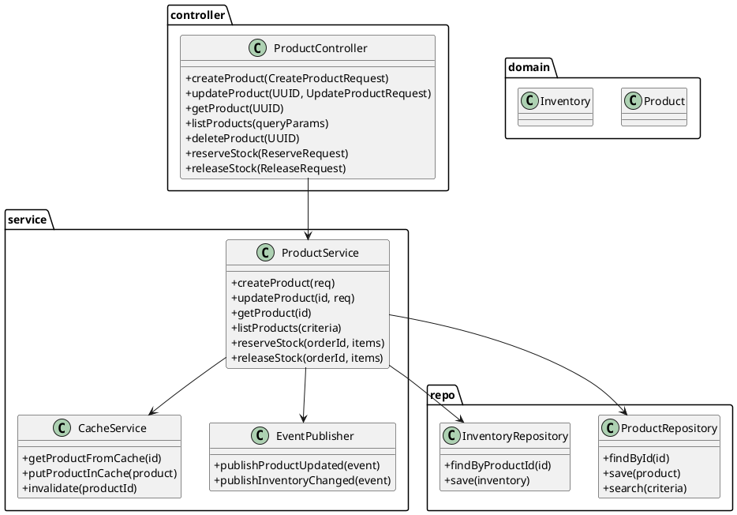
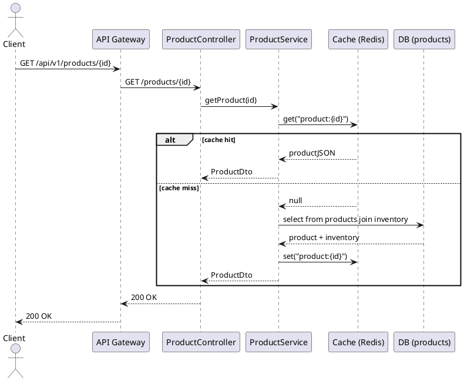
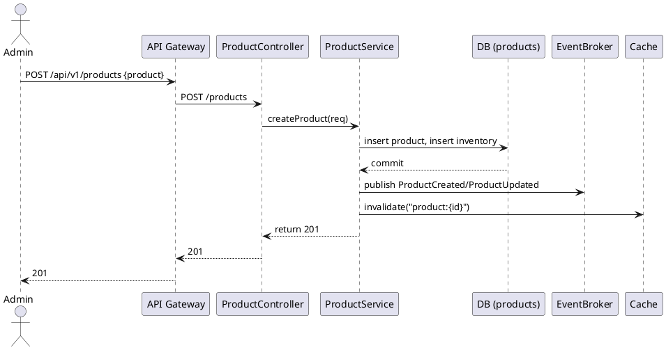
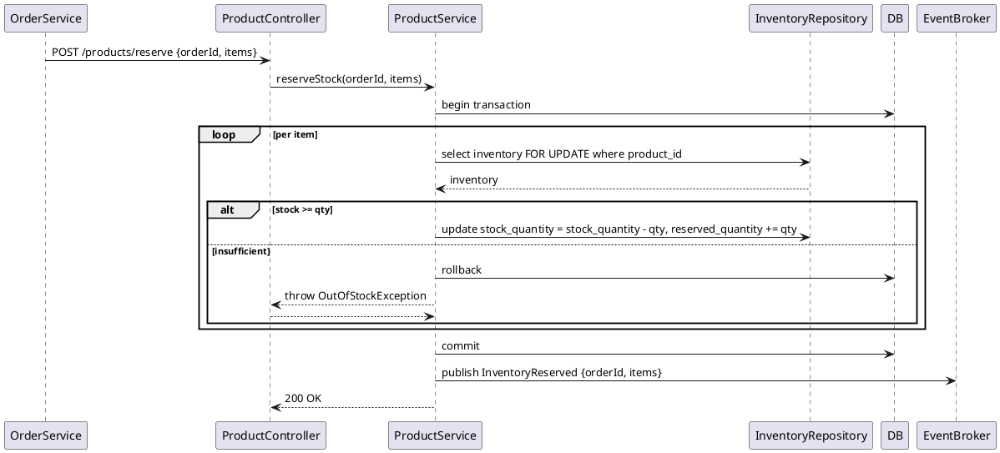

# Product Service — Low‑Level Design (LLD)

> Purpose: Detailed low‑level design for the **Product Service** in the Microservices Mini‑Ecommerce project. This document covers class diagrams (PlantUML), sequence diagrams, DTOs, API contracts (OpenAPI style), persistence and caching strategy, search & filtering design, inventory patterns, concurrency, error handling, observability, testing, folder layout and sample code snippets.

---

## Table of contents

1. Goals & responsibilities
2. Tech stack & libraries
3. Data model & ERD
4. Class diagram (PlantUML)
5. Sequence diagrams (PlantUML)
6. DTOs & models
7. API Contracts (OpenAPI style)
8. Caching & consistency strategy
9. Search & read model options
10. Inventory & stock management
11. Concurrency, transactions & idempotency
12. Error handling strategy
13. Observability & metrics
14. Testing strategy
15. Folder structure
16. Code snippets and examples

---

## 1 — Goals & responsibilities

Product Service responsibilities:

* Manage product catalog (CRUD) and categories
* Serve read APIs for product list, detail, search and filters
* Maintain inventory (stock quantity) and expose reservation endpoint for Order Service
* Publish events when product or inventory changes (ProductUpdated, InventoryChanged)
* Cache product reads in Redis for low latency
* Provide admin APIs for product management (secured)

Non‑functional:

* Low read latency for catalog endpoints
* Strong correctness for inventory operations (no oversell)
* Scalable read model for product search (support pagination)

---

## 2 — Tech stack & libraries

* Java 17, Spring Boot 3.x
* Spring Web, Spring Data JPA (MySQL/Postgres)
* Spring Data Redis (cache)
* Elasticsearch (optional) or built‑in DB full‑text for search/read model (MongoDB read model alternative)
* RabbitMQ / Kafka for eventing
* Resilience4j for resiliency
* Testcontainers, JUnit5, Mockito
* Micrometer + Prometheus, OpenTelemetry/Jaeger

---

## 3 — Data model & ERD

Primary relational tables (MySQL/Postgres):

**products**

* id: UUID (PK)
* sku: varchar(64) unique
* name: varchar(255)
* description: text
* short_description: varchar(512)
* price_cents: bigint
* currency: varchar(3)
* category_id: UUID
* attributes: json (color, size, metadata)
* created_at: timestamp
* updated_at: timestamp
* status: varchar(20) (ACTIVE, INACTIVE)

**inventory**

* product_id: UUID (PK, FK -> products.id)
* stock_quantity: int
* reserved_quantity: int
* version: bigint (optimistic lock)

**categories**

* id: UUID
* name: varchar(255)
* parent_id: UUID nullable

**product_images**

* id: UUID
* product_id: UUID
* url: varchar(1024)
* sort_order: int

Indexes:

* idx_products_sku (sku)
* idx_products_name_fulltext (if DB supports)
* idx_products_category (category_id)
* inventory.primary key on product_id

Read model option: denormalized `product_read` table or Mongo collection for faster reads and search fields.

---

## 4 — Class diagram (PlantUML)



---

## 5 — Sequence diagrams (PlantUML)

### 5.1 Get product detail (read path with cache)



### 5.2 Create product (admin)



### 5.3 Reserve stock (called by Order Service)



Notes: Use `SELECT ... FOR UPDATE` (pessimistic lock) or optimistic locking with `version` field depending on DB and scaling requirements. If Product Service is heavily loaded, consider using Redis distributed locks per product to reduce DB contention (but be careful with correctness).

---

## 6 — DTOs & models

### CreateProductRequest

```json
{
  "sku":"ABC-123",
  "name":"Product name",
  "shortDescription":"...",
  "description":"...",
  "priceCents":9999,
  "currency":"INR",
  "categoryId":"uuid",
  "attributes": {"color":"red","size":"M"},
  "stockQuantity": 100,
  "images": ["https://.../img1.jpg"]
}
```

### ProductDto

```json
{
  "id":"uuid",
  "sku":"ABC-123",
  "name":"Product name",
  "priceCents":9999,
  "currency":"INR",
  "stockQuantity": 100,
  "attributes": {...},
  "images": ["..."],
  "status":"ACTIVE"
}
```

### ReserveRequest

```json
{
  "orderId":"uuid",
  "items":[{"productId":"uuid","quantity":2}],
  "idempotencyKey":"optional"
}
```

### InventoryReserved Event

```json
{
  "eventId":"uuid",
  "orderId":"uuid",
  "items": [{"productId":"uuid","quantity":2}],
  "timestamp":"ISO8601"
}
```

---

## 7 — API Contracts (OpenAPI style)

Base path: `/api/v1/products`

Authentication: Admin endpoints require roles=ADMIN; public endpoints require no admin.

### GET /

* Query params: `q`, `category`, `minPrice`, `maxPrice`, `sort`, `page`, `size`
* Response: paginated `ProductDto[]`

### GET /{id}

* Response: `ProductDto`

### POST /

* Admin only: `CreateProductRequest`
* Response: `201 Created` with `ProductDto`

### PUT /{id}

* Admin only: `UpdateProductRequest`
* Response: `200 OK` `ProductDto`

### DELETE /{id}

* Admin only: `204 No Content`

### POST /reserve

* Auth: Internal service token or JWT from API Gateway (order service)
* Request: `ReserveRequest`
* Response:

  * `200 OK` — reserved
  * `409 Conflict` — out of stock
  * `409` — idempotency duplicate

### POST /release

* Release previously reserved stock (order cancelled)
* Request similar to reserve (orderId + items)
* Response: `200 OK`

Idempotency: `Idempotency-Key` header for `POST /reserve` to avoid duplicate reservations.

---

## 8 — Caching & consistency strategy

### Read cache (Redis)

* Cache product details (`product:{id}`) with TTL (e.g., 60–300s) using cache‑aside pattern.
* Invalidate cache on product updates, price changes, or inventory changes.
* For high QPS, consider a longer TTL plus background refresh (refresh-after-read) pattern.

### Inventory cache

* Do **not** rely on Redis alone for inventory authoritative count unless using a distributed counter with careful correctness guarantees. Use DB as source of truth and optionally maintain a near-real-time inventory cache for reads.
* For reservation path, use DB transaction with `SELECT FOR UPDATE` for correctness. You can also keep an approximate fast path using Redis for optimistic checks followed by DB verification.

### Cache invalidation

* On product update: publish `ProductUpdated` event and invalidate caches in other instances via message broker or use cache key TTL.
* On inventory change: publish `InventoryChanged` event so other services can update their caches or UI.

---

## 9 — Search & read model options

Options depending on feature scope:

1. **DB full‑text / indexed queries** (simple): Use DB `LIKE`, full‑text indexes or Postgres `tsvector` for search. Good for MVP.
2. **Elasticsearch** (recommended for production): Sync product read model to ES for performant search with filters, facets, and relevancy. Use event-driven sync: ProductCreated/ProductUpdated → update ES index.
3. **MongoDB read model**: Maintain a denormalized product_read collection for fast reads and complex query shapes.

Sync pattern: On product change events, update search index asynchronously with retries & DLQ.

---

## 10 — Inventory & stock management patterns

### Approaches

* **Pessimistic locking (DB)**: Use `SELECT FOR UPDATE` on `inventory` rows inside a DB transaction to decrement `stock_quantity` and increase `reserved_quantity`. No oversell; may cause contention under high concurrency.
* **Optimistic locking (version)**: Increment `version` & use UPDATE ... WHERE version = oldVersion; retry on conflict. Scales better but needs retry logic.
* **Reservation + confirm (Saga)**: Product Service provides `reserve` and `confirm` endpoints:

  * `reserve(orderId, items)` → reduces `available` and creates reservation record with expiry
  * `confirm(orderId)` → deducts reserved -> finalizes
  * `release(orderId)` → returns reserved to `available`

Recommended: **Reservation + confirm** with expiry (TTL) to avoid oversell and allow order/payment flows to finalize.

---

## 11 — Concurrency, transactions & idempotency

* Use idempotency keys for `reserve` calls coming from Order Service.
* Ensure reservation operations are idempotent by storing `reservation:{orderId}` in DB/Redis.
* For multiple concurrent reserves, DB locks or optimistic retry ensure consistency.
* Expire reservations via background scheduler or delayed messages to release stock if not confirmed.

---

## 12 — Error handling strategy

Standardize error format: `{code, message, details}`.

Errors:

* `PRODUCT_NOT_FOUND` → 404
* `OUT_OF_STOCK` → 409
* `INVALID_REQUEST` → 400
* `RESERVATION_ALREADY_EXISTS` → 409 (idempotency)
* `INTERNAL_ERROR` → 500

Log full stack traces server-side; return safe messages to clients. Include traceId and requestId headers for correlation.

---

## 13 — Observability & metrics

Metrics to expose:

* `product.reads.count`
* `product.cache.hits`
* `product.cache.misses`
* `product.updates.count`
* `inventory.reservations.count`
* `inventory.release.count`
* `inventory.outOfStock.count`

Tracing: propagate trace across API calls and events. Add productId and orderId as span tags when applicable.

Logging: structured JSON with fields: `service`, `level`, `traceId`, `requestId`, `productId`, `orderId`.

---

## 14 — Testing strategy

Unit tests:

* ProductService: create/update/get/search logic, cache interactions (mock Redis), reservation logic (mock inventory repo)
* Idempotency and reservation expiry logic

Integration tests:

* Testcontainers for DB, Redis, RabbitMQ
* Full flows: create product -> reserve -> confirm -> release

Contract tests:

* Consumer-driven contract tests with Order Service for `reserve`/`release` API

E2E tests:

* Simulate high concurrency reservations to validate no oversell and proper retry behavior

---

## 15 — Folder structure

```
product-service/
  src/main/java/com/microecom/product
    controller/
      ProductController.java
    service/
      ProductService.java
      InventoryService.java
      SearchService.java
    client/
      SearchIndexClient.java (ES)
    repository/
      ProductRepository.java
      InventoryRepository.java
    model/
      Product.java
      Inventory.java
    dto/
      CreateProductRequest.java
      ProductDto.java
      ReserveRequest.java
    messaging/
      ProductEventPublisher.java
      ProductEventListener.java
    config/
      CacheConfig.java
      MessagingConfig.java
    exception/
      ProductExceptions.java
  src/test/java/...
  Dockerfile
  application.yml
  k8s/
```

---

## 16 — Code snippets & examples

### 16.1 Cache-aside read (pseudo)

```java
public ProductDto getProduct(UUID id) {
  String key = "product:"+id;
  ProductDto cached = redis.get(key);
  if (cached != null) return cached;

  Product product = productRepository.findById(id)
       .orElseThrow(() -> new NotFoundException("PRODUCT_NOT_FOUND"));

  ProductDto dto = map(product);
  redis.set(key, dto, CACHE_TTL_SECONDS);
  return dto;
}
```

### 16.2 Reserve stock (pessimistic SQL approach) (pseudo)

```java
@Transactional
public void reserveStock(UUID orderId, List<Item> items) {
  if (redis.exists("reservation:"+orderId)) throw new ReservationExistsException();

  for (Item it : items) {
    Inventory inv = inventoryRepo.findByProductIdForUpdate(it.getProductId());
    if (inv.getStockQuantity() - inv.getReservedQuantity() < it.getQuantity()) {
      throw new OutOfStockException(it.getProductId());
    }
    inv.setReservedQuantity(inv.getReservedQuantity() + it.getQuantity());
    inventoryRepo.save(inv);
  }

  // persist reservation record
  reservationRepo.save(new Reservation(orderId, items, expiresAt));
  redis.set("reservation:"+orderId, "PENDING", RESERVATION_TTL);
  eventPublisher.publish(new InventoryReservedEvent(...));
}
```

### 16.3 Release reservation (pseudo)

```java
@Transactional
public void releaseReservation(UUID orderId) {
  Reservation res = reservationRepo.findByOrderId(orderId).orElse(null);
  if (res == null) return; // idempotent
  for (Item it: res.getItems()) {
    Inventory inv = inventoryRepo.findByProductIdForUpdate(it.getProductId());
    inv.setReservedQuantity(inv.getReservedQuantity() - it.getQuantity());
    inventoryRepo.save(inv);
  }
  reservationRepo.delete(res);
  redis.del("reservation:"+orderId);
  eventPublisher.publish(new InventoryReleasedEvent(...));
}
```

---

## 17 — Security considerations

* Admin endpoints protected by role checks (ADMIN).
* Internal endpoints (`/reserve`, `/release`) should require service-to-service authentication (mutual TLS, service JWT, or API key) and not be publicly accessible.
* Validate and sanitize product attributes and image URLs.
* Rate limit search and listing endpoints to prevent scraping.

---

## 18 — Next steps (I can produce right away)

* PlantUML PNG/SVG exports for the diagrams above
* OpenAPI (Swagger) YAML for Product Service APIs
* Starter Spring Boot scaffold for Product Service (controllers, services, repos, Dockerfile)
* Integration test (Testcontainers) for reserve/confirm/release flows

Pick one and I’ll generate it immediately.
